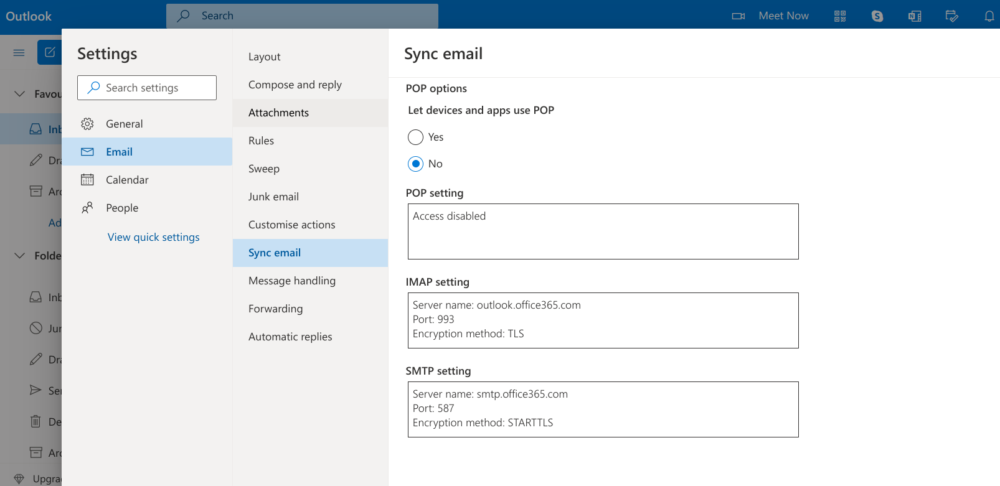
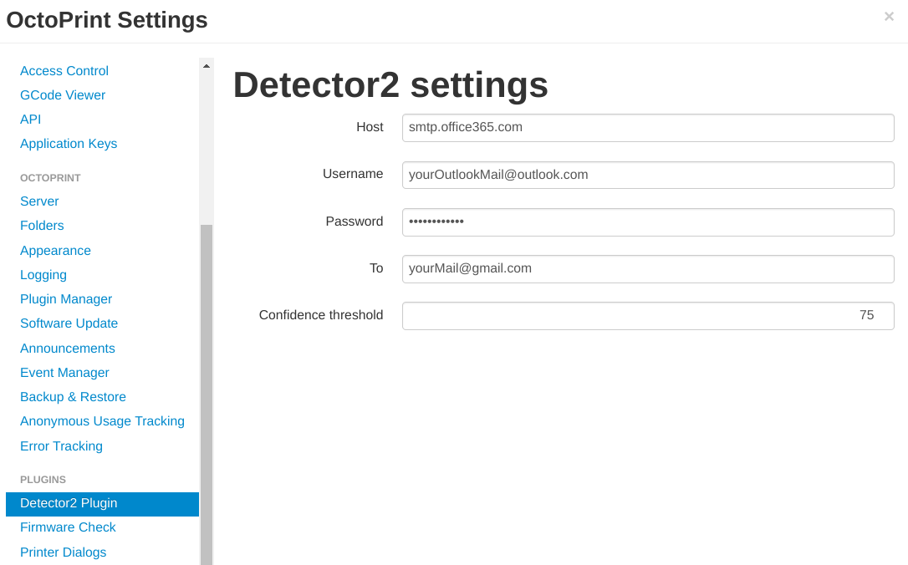
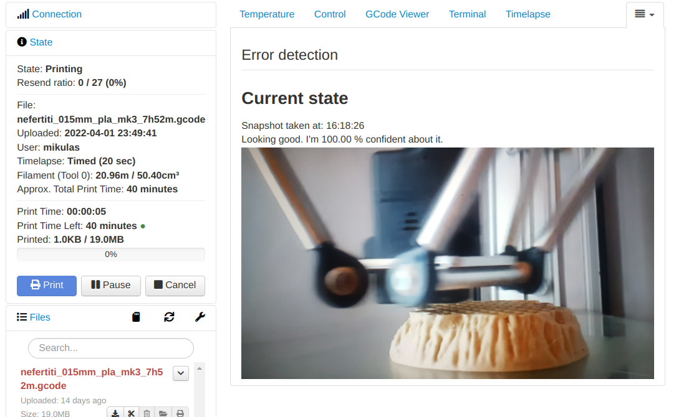
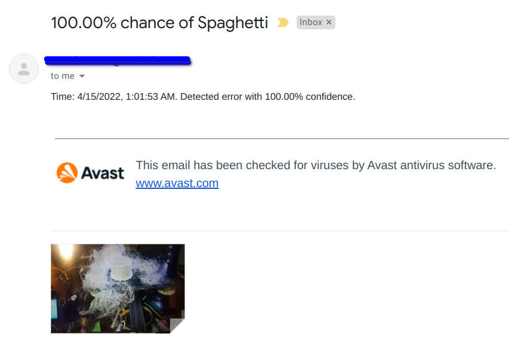

# OctoPrint-Detector2

Octoprint-Detector2 is a detection plugin that runs in locally your browser and emails you if it detects some spaghetti, stringing or blobs on your print. All you need is an email account and a PC.
It is completely free without any monthly subscriptions or one time fees unlike some similar plugins. If it detects an error it sounds the alarm and sends you an email with the latest image snapshot of the print.
##### Used services:
Tensorflow.js for prediction, https://www.smtpjs.com/ to send mail via javascript and Outlook to serve as an SMTP server.

## setup
Install via the [Plugin Manager](https://docs.octoprint.org/en/master/bundledplugins/pluginmanager.html) or manually using latest release here:

    https://github.com/mikulash/Octoprint-detector2/releases
    
## Configuration

1. To enable email sending it needs to use an SMTP connection. Free and easy to set up is via Outlook. For now, this plugin uses exclusively Outlook so at this moment there is no need for extra set-up. Just creating an email will do it.

2. In the settings of this plugin enter the username and password for created Outlook account.

3. This plugin uses snapshots sent by the Timelapse plugin, which is preinstalled with Octoprint. Go to the Timelapse tab and choose snapshot interval. The minimal recommended interval is 10 seconds to let the plugin have enough time to detect errors from an image.
After finishing printing, the timelapse is created, and its deletion is not implemented. I suggest for now deleting these timelapse manually or using another plugin to delete them automatically.
4. Once you start printing you should see the last sent image and result that this detector gets as well with confidence of the result. But if you would

5. If the confidence of the error is greater than 75 %, it starts the alarm and emails you the detected error. Email is sent exactly once to prevent spamming. You can change the confidence threshold in settings.

6. That’s it. You just need to leave the octoprint tab running in the browser and let it work.

## Q&A
#### Email sending stopped working.
To prevent spamming, Outlook has a daily limit for services like this. Open the Outlook account and you should have received a prompt to verify this account. After verification, you should be able to start receiving emails again.

## Supporting the development
It would be greatly appreciated if you would send me your time lapses. Especially the ones with errors not detected. It would help me to improve the model and add new types of errors to detect.
It is super easy. Just upload the generated time-lapse to [Swiss transfer](https://www.swisstransfer.com/en) and send me the generated link to <octoprint.detector2@gmail.com>. Thanks in advance!

## problems or feedback?
If you are having any trouble or have an idea to implement, let me know! This plugin is part of my bachelor thesis so any feedback would be much appreciated. Reach me at the discussion in this plugin [GitHub repository](https://github.com/mikulash/Octoprint-detector2/discussions) or send me your thoughts about this plugin to <octoprint.detector2@gmail.com>.
